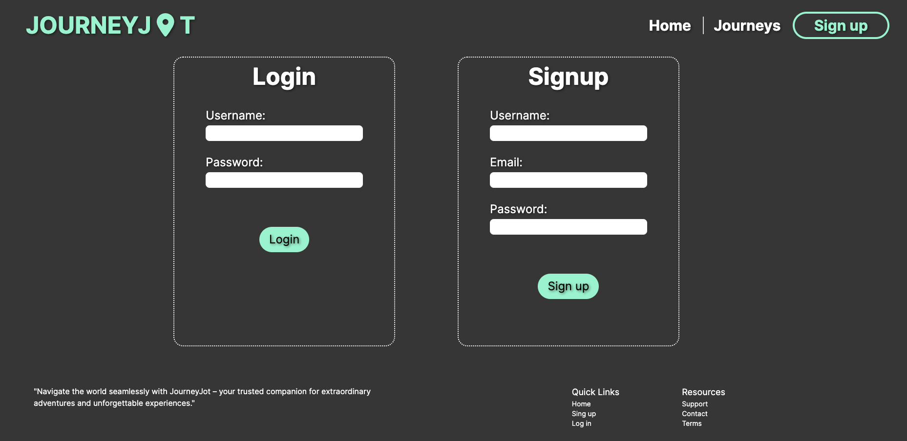

<h1 align="center">Journey Jot </h1>

  
  
  
  

## Description 📚

Organize your trips and treks with JourneyJot! This application will allow users to log and track different trips or adventures as well as create a suggested packing list. This application will also give you the weather for where you are going so you can make sure you are prepared for anything Mother Nature throws your way. The user can refer to the trips from the past and remember the details, favorites stops and great memories.

## Table of Contents

-   [User-Story](#user-story)
-   [Acceptance-Criteria](#acceptance-criteria)
-   [Installation](#installation-📋)
-   [Usage](#usage-🏁)
-   [Dependancies](#dependancies)
-   [Credits](#credits)
-   [License](#license)
-   [Authors](#authors-👋🏽)

## User Story

AS A traveler: I WANT to prepare for a trip with what to pack, the weather and previous trip experience SO THAT I can be prepared and keep my trip details all in one place.

## Installation 📋

Users can clone the repository to a local machine by running `git clone https://github.com/Umbelth94/JourneyJot.git`

Once the repo is set the user can continue to install all the dependacies needed by running `npm install`. A .env page will need to be created with the users mysql credentials and an openai key. Log into mysql by using `mysql -u root -p` and typying your password. Once you are logged in, set up the databases by running `SOURCE db/schema.sql` and run the seeds by running `npm run seed`.

Once all the initial start up commands are completed, the user can start the server by running `node server.js`.

## Usage 🏁

This project is deployed [here](https://journey-jot-decc05f3600a.herokuapp.com/) using Heroku.

The user sign up and create an account to use the application. Once the user has signed up, they can access all of the features of the app. The user can log a journey to the newsfeed that can be viewed by everyone. They can also go to the 'Plan a Trip' page and put in where they would like to go, the activities they would like to focus on and the month and JourneyJot will put together suggestions for the user. They can then save those suggestions to the 'My Trips' page.

This is the homepage.
 

This is the login screen.
 

 

## Dependancies

These are the packages we installed to create this project:

-   [Bcrypt](https://www.npmjs.com/package/bcrypt)
-   [body-parser](https://www.npmjs.com/package/body-parser)
-   [connect-session-sequelize](https://www.npmjs.com/package/connect-session-sequelize)
-   [dotenv](https://www.npmjs.com/package/dotenv)
-   [eslint](https://eslint.org/)
-   [express](https://expressjs.com/)
-   [express-handlebars](https://www.npmjs.com/package/express-handlebars)
-   [express-session](https://www.npmjs.com/package/express-session)
-   [husky](https://typicode.github.io/husky/)
-   [Mysql2](https://www.npmjs.com/package/mysql2)
-   [nodemon](https://nodemon.io/)
-   [openai](https://platform.openai.com/overview)
-   [prettier](https://prettier.io/docs/en/install)
-   [Sequelize](https://www.npmjs.com/package/sequelize)
-   [tailwind](https://tailwindui.com/)

## Credits

List of the links that made us succeed this project:

-   https://www.geeksforgeeks.org/how-to-create-an-image-element-dynamically-using-javascript/
-   https://unsplash.com/s/photos/travel
-   https://developer.mozilla.org/en-US/docs/Web/API/Element/remove
-   https://sentry.io/answers/how-do-i-make-the-first-letter-of-a-string-uppercase-in-javascript/#:~:text=The%20Solution&text=The%20toUpperCase()%20method%20converts,not%20alter%20the%20original%20string.
-   https://www.youtube.com/watch?v=o1NikOxElqE
-   https://www.youtube.com/watch?v=A7ga_EKgGK4
-   https://www.youtube.com/watch?v=cSuEAD-Tnd4

## License

ISC License (ISC)

Copyright (c) 2024 Megan Schneider, Sergia S. Ardila-Alvarado, Travis Umbel

Permission to use, copy, modify, and/or distribute this software for any purpose with or without fee is hereby granted, provided that the above copyright notice and this permission notice appear in all copies.

THE SOFTWARE IS PROVIDED "AS IS" AND THE AUTHOR DISCLAIMS ALL WARRANTIES WITH REGARD TO THIS SOFTWARE INCLUDING ALL IMPLIED WARRANTIES OF MERCHANTABILITY AND FITNESS. IN NO EVENT SHALL THE AUTHOR BE LIABLE FOR ANY SPECIAL, DIRECT, INDIRECT, OR CONSEQUENTIAL DAMAGES OR ANY DAMAGES WHATSOEVER RESULTING FROM LOSS OF USE, DATA OR PROFITS, WHETHER IN AN ACTION OF CONTRACT, NEGLIGENCE OR OTHER TORTIOUS ACTION, ARISING OUT OF OR IN CONNECTION WITH THE USE OR PERFORMANCE OF THIS SOFTWARE.

## Authors 👋🏽

 Megan Schneider | [schneidsmc](https://github.com/schneidsmc) 
 Sergio Ardila-Alvarado | [Stroyer210](https://github.com/Stroyer210) 
 Travis Umbel | [Umbelth94](https://github.com/Umbelth94) 
